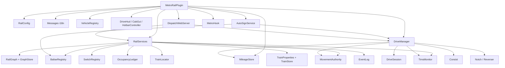

# 开发与构建

面向要改代码 / 做二次开发的工程师。

---

## 1. 环境

| 项目 | 版本 |
| :-- | :-- |
| JDK | **17+** |
| Maven | 3.6+ |
| 编译依赖 | `org.spigotmc:spigot-api:1.18.2-R0.1-SNAPSHOT`（`provided`） |

Metro **不是编译期依赖** —— 插件通过**反射**访问 Metro 的 API（见第 5 节）。

---

## 2. 构建

```bash
# 在项目根目录
mvn -o clean package
```

产物：

```
target/MetroRail-1.0.0.jar
```

（`finalName = ${project.name}-${project.version}`，改 `pom.xml` 的 `<version>` 即改产物名。）

### 资源过滤

`pom.xml` 里只对 `plugin.yml` 开 `filtering`，用于把 `${project.version}` 注入 `version` 字段：

```xml
<resource>
  <directory>src/main/resources</directory>
  <filtering>true</filtering>
  <includes><include>plugin.yml</include></includes>
</resource>
```

**其余资源（`lang/`、`vehicles/`、`web/`）一律不过滤**，避免把语言文件里的 `%s` / `{}` 占位符替换掉。

---

## 3. 目录结构

```
.
├── pom.xml
├── README.md
├── docs/                                  # 文档（你正在看的）
├── preview/                               # 调度台离线预览（模拟数据，复用真实 style.css）
│   ├── index.html
│   └── mock-api.js
└── src/main/
    ├── java/cn/aqcraft/metrorail/
    │   ├── MetroRailPlugin.java            # 主类：生命周期 / ticker / 组件装配
    │   ├── command/MrCommand.java          # /mr 全部子命令 + Tab 补全
    │   ├── config/RailConfig.java          # config.yml 强类型视图
    │   ├── data/MileageStore.java          # 里程
    │   ├── drive/                          # 驾驶与编组
    │   ├── hud/                            # HMI：计分板 / BossBar / 驾驶室 / 快捷栏
    │   ├── i18n/Messages.java              # 语言文件加载
    │   ├── listener/RailListener.java      # 应答器登记 / 道岔交互 / 掉线撤权
    │   ├── metro/MetroHook.java            # Metro 反射对接层
    │   ├── rail/                           # 列控：图 / 道岔 / 应答器 / 占用 / MA / TIMS / 属性
    │   ├── signs/AutoSignService.java      # 自动牌子行为
    │   └── web/DispatchWebServer.java      # 调度网页 + HTTP API
    └── resources/
        ├── plugin.yml
        ├── config.yml
        ├── lang/{zh_CN,en_US}.yml
        ├── vehicles/{default,express}.yml
        └── web/{index.html,style.css,app.js}
```

---

## 4. 架构



### 运行时节奏

`MetroRailPlugin#startTicker()` 用 `runTaskTimer` 每 `drive.tick-interval` tick 执行：

```java
driveManager.tick(interval);   // 物理积分、TIM5、MA 重算
autoSigns.tick();              // 站停 / 强制停车牌
hud.update(driveManager);      // 计分板 / BossBar
```

### 关键类

| 类 | 职责 |
| :-- | :-- |
| `DriveManager` | 会话管理（驾驶权）、编组、物理 tick、MA 调度 |
| `DriveSession` | 单次驾驶的状态：车型、级位、换向、速度、状态机、MA、完整性、单位 |
| `RailGraph` / `GraphStore` | 有向轨道图的建模与持久化（`scan()` 洪泛建图） |
| `MovementAuthority` | MA / EoA 计算（occupied / end-of-track / max-lookahead / no-graph） |
| `OccupancyLedger` | 占用与预约（`occupy` 独占 / `hold` 共享），可持久化 |
| `SwitchRegistry` / `BaliseRegistry` | 道岔与应答器登记（均带坐标 id ↔ 方块互转） |
| `TimsMonitor` | 完整性监测（车厢齐全 / 采样时效 / 间距） |
| `AutoSignService` | 牌子驱动的行为（站停、强停、限速、属性、生成） |
| `DispatchWebServer` | 静态页面 + `/api/state` `/api/events` `/api/switch` |

---

## 5. 与 Metro 的对接方式

`MetroHook` 用**纯反射**访问 Metro：

```
目标类：org.cubexmc.metro.api.MetroAPI      // Kotlin object
入口：  static MetroAPI getInstance()
取数：  getLines() / getStops()
```

设计取舍：

- **不把 Metro 打进 jar**，也**不在编译期 import** —— 避免版本强耦合。
- Metro 缺失 / API 变动时**只降级**（`available()` 返回 false，`describe()` 显示原因），
  MetroRail 的驾驶功能照常可用。
- `refresh()` 可以在 Metro 晚于 MetroRail 初始化时重新取一次单例。

`/mr status` 的「Metro 对接」一行就是 `MetroHook#describe()`。

> **注意**：`plugin.yml` 里仍是 `depend: [Metro]`（硬依赖）。若要允许无 Metro 加载，
> 改成 `softdepend: [Metro]` 即可 —— 运行时代码已经能优雅降级。

---

## 6. 扩展点

| 想做什么 | 从哪入手 |
| :-- | :-- |
| 加一个车型 | 放一个 `vehicles/<id>.yml`，无需改代码 |
| 加一种语言 | 复制 `lang/zh_CN.yml` → `lang/<locale>.yml`，补键 |
| 加一个子命令 | `MrCommand`：`SUBS` + `switch` 分支 + `onTabComplete` + `lang` 文案 |
| 加一种牌子 | `BaliseRegistry.TAGS` + `tagOf()` + `AutoSignService.tick()` 分支 |
| 让 `[property]` 真正生效 | 在 `AutoSignService` 中读取 `propertyValue(balise, "V_target", …)` 并写入 `DriveSession` |
| 让 `[spawn]` 被红石触发 | 在 `RailListener` 监听 `BlockRedstoneEvent` / `PlayerInteractEvent`，调用 `handleSpawn()` |
| 改网页 | 改 `src/main/resources/web/`，或用 `preview/index.html` 离线调试 |
| 接别的调度前端 | 直接消费 `GET /api/state`（JSON 快照） |

### 已知未接线（规划中）

- `[property]` 的**自动应用**（目前只提供 `propertyValue()` 读取接口）。
- `[spawn]` 的**自动触发**（`handleSpawn()` 已实现，未接红石 / 定时器）。
- `/mr clearkm`（清空里程）。
- 基于真实**玩家位置 / Metro 停靠区**的占用识别（现由 MA 预约驱动）。

---

## 7. 调试技巧

| 目的 | 做法 |
| :-- | :-- |
| 看会话状态 | `/mr status`（含模式、状态机、MA、完整性） |
| 看图 | `/mr graph status` |
| 看事件 | 调度网页 events 栏，或 `GET /api/events` |
| 快速换配置 | 改 `config.yml` → `/mr reload` |
| 单独调网页 | `preview/index.html`（模拟数据）+ `mock-api.js` |
| 调语言 | 改 `plugins/MetroRail/lang/zh_CN.yml` → `/mr reload` |

---

## 8. 提交前检查

```bash
mvn -o clean package          # 必须能编译通过
```

- 不要提交 `target/`。
- 新增的 `config.yml` 键：同步更新 `RailConfig` 默认值 **和** `README.md` / `docs/配置参考.md`。
- 新增命令 / 权限：同步更新 `plugin.yml`、`lang/*.yml`、`docs/命令参考.md`。
- 改了 `vehicles/*.yml` 或 `lang/*.yml` 的**默认值**时注意：磁盘上已有的文件**不会**被覆盖，
  老服需要手动改或删文件重新生成。

---

## 9. CI/CD（GitHub Actions）

仓库：<https://github.com/ALingqing/MetroRail>

### `.github/workflows/build.yml` —— 自动构建

| 触发 | 分支 push（`main` / `master`）、PR、手动 `workflow_dispatch` |
| :-- | :-- |
| 步骤 | checkout → JDK 17（temurin，开启 Maven 缓存）→ `mvn -B -ntp clean package` → 校验 jar 内 `plugin.yml` / `config.yml` / `MetroRailPlugin.class` → 上传 Artifact |
| 产物 | Artifact 名 `MetroRail`，保留 30 天 |

在 Actions 页面点进任意一次运行，即可在 **Artifacts** 里下载 `MetroRail-*.jar`。

### `.github/workflows/release.yml` —— 自动发布

| 触发 | 推送 `v*` 标签，或手动 `workflow_dispatch`（可填版本号） |
| :-- | :-- |
| 版本解析 | 标签触发 → 取 `${GITHUB_REF_NAME#v}`；手动触发 → 用输入的版本号；都没有 → 读 `pom.xml` 当前版本 |
| 步骤 | checkout → JDK 17 → `mvn versions:set -DnewVersion=<ver>` → `mvn clean package` → `softprops/action-gh-release` 创建 Release 并附上 jar |
| 权限 | `permissions: contents: write` |

**发布新版只要打一个标签：**

```bash
git tag v1.0.1
git push origin v1.0.1
```

几秒后 GitHub 上就会自动出现 `MetroRail v1.0.1` 的 Release，附件是 `MetroRail-1.0.1.jar`
（工作流临时把 pom 版本改成 `1.0.1` 再编译，所以 jar 名与标签一致；**不会**把改动提交回仓库）。

> 若想先预览再发：在 Actions → Release → Run workflow，填一个版本号即可（会在当前分支的 HEAD 上打标签）。

### 用到的 Action

| Action | 版本 |
| :-- | :-- |
| `actions/checkout` | `v7` |
| `actions/setup-java` | `v6` |
| `actions/upload-artifact` | `v7` |
| `softprops/action-gh-release` | `v3` |

### 版本号约定

`pom.xml` 的 `<version>` 是**开发版本**（当前 `1.0.0`）。日常提交不必动它；

- 发 `v1.0.1` 标签 → Release 里的 jar 就是 `MetroRail-1.0.1.jar`。
- 想让仓库里的默认版本也跟上，可在发布后手动把 `pom.xml` 的版本改成下一个开发号（如 `1.0.2-SNAPSHOT`）。
